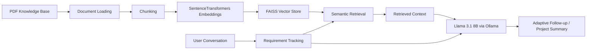

# RAG Conversational AI Assistant

A portfolio-safe implementation of a Retrieval-Augmented Generation (RAG) conversational assistant for structured website/app requirement gathering.

The system combines semantic retrieval with a local large language model to keep conversations grounded in a domain-specific knowledge base while progressively collecting project requirements.

> **Portfolio note:** This repository is a clean, public-facing adaptation of techniques used in an academic/industry project. It does not include proprietary company code, documents, credentials, internal prompts, datasets, or infrastructure.

## Architecture



## Key Features

- PDF-based knowledge ingestion with `PyPDFLoader`
- Recursive text chunking
- Dense semantic embeddings with SentenceTransformers
- Local vector search with FAISS
- Local Llama 3.1 8B inference through Ollama
- Conversational requirement tracking
- One-question-at-a-time adaptive follow-up generation
- Basic input validation and structured project summaries
- Persistent FAISS index to avoid recomputing embeddings
- Configurable model generation parameters

## Technology Stack

| Area | Technologies |
|---|---|
| Language | Python |
| LLM | Llama 3.1 8B |
| LLM Runtime | Ollama |
| RAG | LangChain, FAISS |
| Embeddings | SentenceTransformers |
| Document Processing | PyPDFLoader, RecursiveCharacterTextSplitter |
| ML / Deep Learning | PyTorch |
| Development | Git, Docker-ready structure |

## Conversation Flow

The assistant progressively collects structured project information such as:

- Product / project name
- Project type
- Purpose
- Target audience
- Design style
- Core features
- Content needs
- Technical requirements
- Special requests

The conversational component maintains history and adapts the next question to the current topic and previous user response.

## Retrieval Pipeline

1. Load a PDF knowledge source.
2. Split the document into overlapping chunks.
3. Generate dense embeddings for each chunk.
4. Build a FAISS vector index.
5. Retrieve semantically relevant chunks for the conversation.
6. Pass retrieved context together with the conversation state to the LLM.
7. Generate a focused follow-up question or a structured project summary.

## Research Evaluation

The associated master's thesis evaluated the conversational assistant across 18 user dialogues.

Reported results included:

- **89% requirement completeness**
- **0.87 average semantic fidelity**
- **4.4/5 follow-up relevance**

The generated website artifacts were also evaluated separately, including a **4.7/5 design-fidelity rating** and approximately **92% functional-requirement coverage** in the reported case study.

These figures describe the thesis evaluation and are **not automatically reproducible from this public repository**, because the original evaluation data, proprietary knowledge base, and company-specific implementation are intentionally excluded.

## Local vs. Cloud Architecture

The broader research compared a local deployment with a cloud-oriented architecture.

### Local

- Ollama
- Llama 3.1 8B
- SentenceTransformers
- FAISS
- LangChain

### Cloud research environment

- Google Vertex AI
- AlloyDB / pgvector
- Cloud infrastructure for scalable retrieval and generation

The public repository focuses on the local, reproducible RAG workflow. Company-specific cloud configuration and credentials are not included.

## Project Structure

```text
rag-conversational-ai/
├── config/
│   └── config.example.yml
├── data/
│   └── README.md
├── docs/
│   └── architecture.md
├── src/
│   └── rag_app.py
├── website_generator.py
├── .gitignore
├── README.md
└── requirements.txt
```
## Installation

### 1. Clone the repository

```bash
git clone https://github.com/behnaz11216/rag-conversational-ai.git
cd rag-conversational-ai
```

### 2. Create an environment

```bash
python -m venv .venv
```

Windows:

```bash
.venv\\Scripts\\activate
```

macOS / Linux:

```bash
source .venv/bin/activate
```

### 3. Install dependencies

```bash
pip install -r requirements.txt
```

### 4. Install and start Ollama

Install Ollama separately and pull the model:

```bash
ollama pull llama3.1:8b
```

### 5. Add your own knowledge-base PDF

Place a non-confidential PDF in:

```text
data/source.pdf
```

Do not upload proprietary company documents.

### 6. Run

```bash
python src/rag_app.py
```

## Example

The assistant can turn a broad idea such as:

> "I want to build an online bookstore."

into a structured conversation covering project type, audience, design style, features, content, and technical requirements.

## Responsible Publication

This repository intentionally excludes:

- Proprietary company source code
- Internal company documents
- Confidential prompts
- API keys or credentials
- Internal datasets
- Private infrastructure configuration
- Unpublished company-specific evaluation data

The repository is intended to demonstrate the engineering concepts, architecture, and implementation skills behind the work while respecting confidentiality.

## Author

**Behnaz Mohammadi**

AI Engineer & Data Scientist focused on Generative AI, LLMs, RAG, NLP and Machine Learning.

- LinkedIn: https://www.linkedin.com/in/behnaz-mohammadi/
- Google Scholar: https://scholar.google.com/citations?user=HTUZKqIAAAAJ&hl=en
